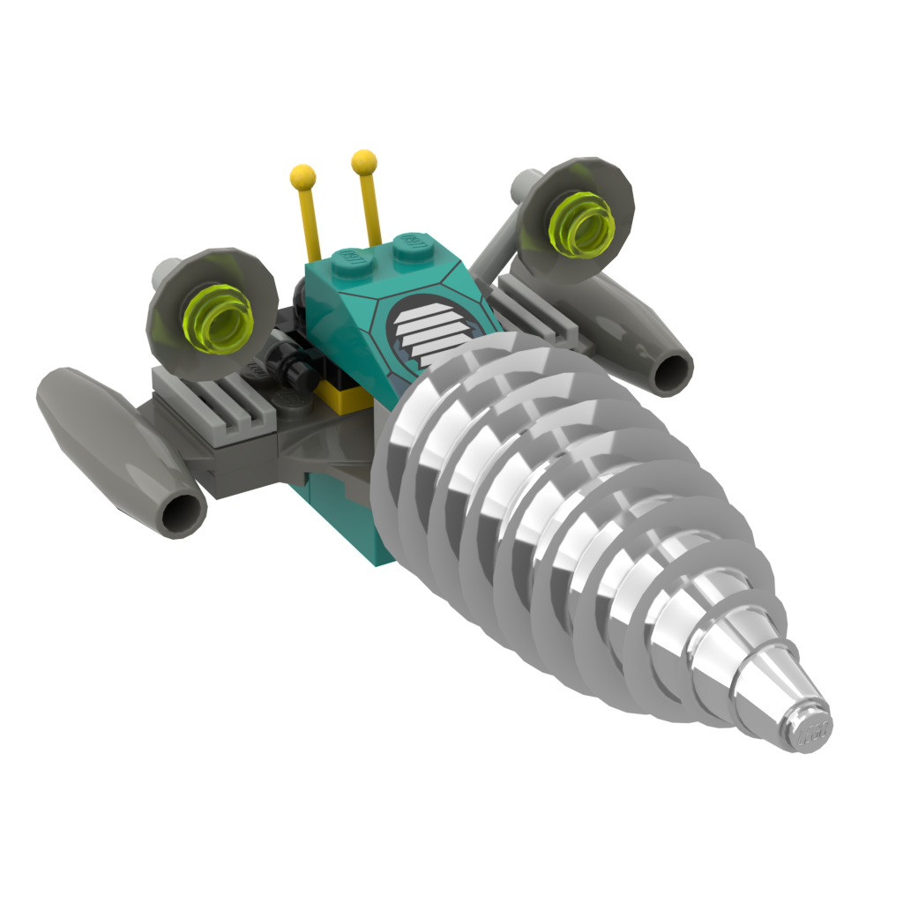

# brick-recreations

## Mission
Preserve the rich history of LEGO by digitally recreating models in LEGO media

Note that LEGO is a trademark of the LEGO Group of companies which does not sponsor, authorize or endorse this project.

## Values
* **Accuracy**: recreation are consistent with how the LEGO group created at the time
  * Use only part molds which existed at the time
  * For a given part, strive to use colors in which it was produced. You can make exceptions for parts which are significant to the model as Lego did produce parts in novel colors for prototyping
* **Reproducability**: anyone can quickly verify the accuracy of a recreation
  * Store any referenced materials (3D models, screenshots) in this repository
* **Openness**: anyone can contribute missing recreations, suggest alterations, or flag inaccuracies

## Contributing
Read our [Contribution Guidelines](contributing.md) to learn how you can help with this project.

## Models
* [BIONICLE](/models/bionicle/)
* LEGO Design
    * [DS2023 Cosmic Daydreams](/models/lego-design/ds2023-cosmic-daydreams/)
* LEGO Chess (1998)
    * [Pirates Chess Pieces](/models/lego-chess/pirates-pieces)
    * [Western Chess Pieces](/models/lego-chess/western-pieces)
    * [Classic Chess Pieces](/models/lego-chess/classic-pieces)

### LEGO Rock Raiders
#### Prototypes

#### Alternate Builds
| Image | Name |
|-|-|
|  | [Double-Laser Vehicle](/models/lego-rock-raiders/alternate-builds/double-laser-vehicle)
|  | [Laser Buggy](/models/lego-rock-raiders/alternate-builds/laser-buggy)
|  | [Mining Craft](/models/lego-rock-raiders/alternate-builds/mining-craft)
|  | [Unnamed Drilling Vehicle](/models/lego-rock-raiders/alternate-builds/unnamed-drilling-vehicle)
