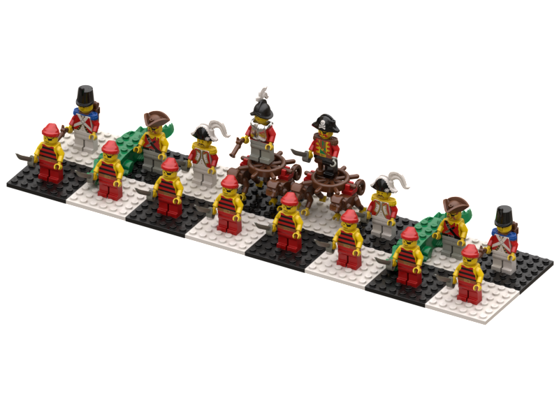

brick-media-builds
================

Mission
-------
Create and preserve digital representations of buildable models present in LEGO media. Note that LEGO is a trademark of the LEGO Group of companies which does not sponsor, authorize or endorse this project.

### LEGO Chess (1998)
| Image | Name |
|-|-|
|  | [Pirates Chess Pieces](/builds/lego-chess/pirates-pieces)
|  | [Western Chess Pieces](/builds/lego-chess/western-pieces)

Credits
-------
* The [LEGO Group](https://www.lego.com/en-us/aboutus/lego-group)