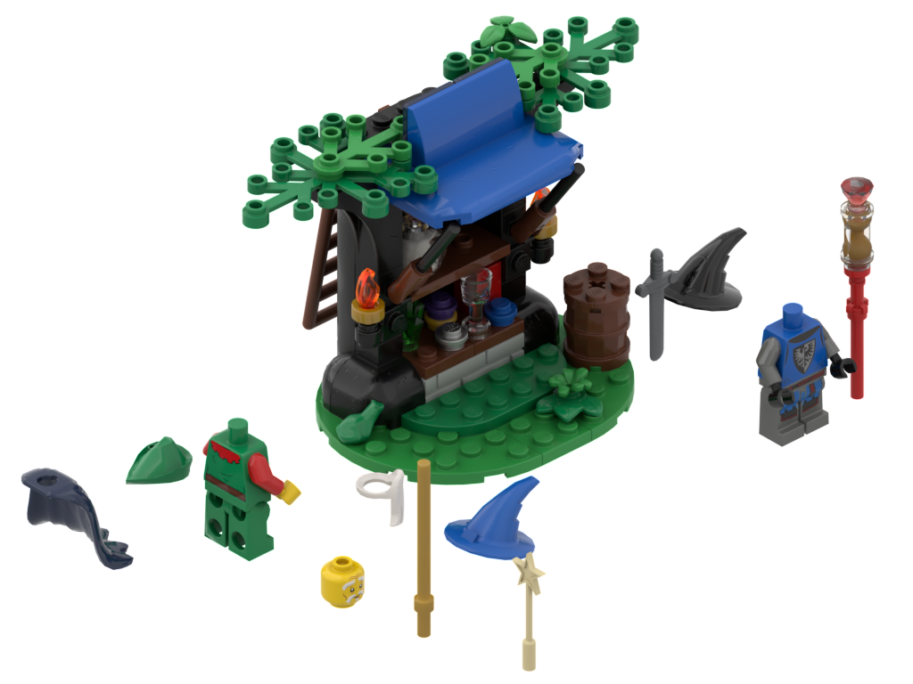

The Magic of Play
=================

Notes
-----
* Curved 2x4 blue piece should have logo on it
* The wizard's torso and the witch's torso are both set-exclusive parts

Missing many pieces including (am omitting some):
* Baby owl
* Round 1x1 tile with dragon print
* [Minifigure, Head Alien Robot with Medium Azure Eyes and Mouth, Dark Blue Panels with Silver Circuitry and Circles Pattern](https://www.bricklink.com/v2/catalog/catalogitem.page?P=3626pb3345&name=Minifigure,%20Head%20Alien%20Robot%20with%20Medium%20Azure%20Eyes%20and%20Mouth,%20Dark%20Blue%20Panels%20with%20Silver%20Circuitry%20and%20Circles%20Pattern&category=%5BMinifigure,%20Head%5D#T=S&C=15&O={%22color%22:15,%22iconly%22:0})
* [Minifigure, Utensil Bottle, Florence Flask with Molded Trans-Yellow Fluid Pattern](https://www.brickowl.com/catalog/lego-transparent-round-bottom-flask-with-transparent-yellow-5608)
* Minifigure, Head Dual Sided White Eyebrows, Reddish Brown Glasses with Nougat Lenses, Closed Eyes, Chin Dimple, Wrinkles, Grin / Open Mouth Smile Pattern
* [Red Arm with Technic Pin with Black Hand](https://www.bricklink.com/v2/catalog/catalogitem.page?P=67906c01#T=S&C=5&O={%22color%22:%225%22,%22iconly%22:0})
* Blue Hips and Legs with Dark Blue Sash and Knee Wrappings, Black Coattails and Zori Sandals Pattern