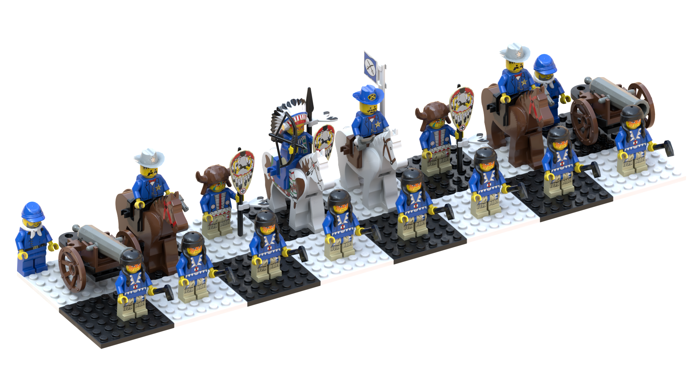

Western Pieces
==============

Notes
-----
* The cannon and cannoneer appear to be from [6176 Weapons Wagon](https://www.bricklink.com/v2/catalog/catalogitem.page?I=6716-1#T=S&O={%22iconly%22:0}) so I based the cannon's build on that set
* The queen's face is the [face with orange face paint](https://www.bricklink.com/v2/catalog/catalogitem.page?P=3626bpx57) modified to have red lips
* King should have [calvalry general torso](https://www.bricklink.com/v2/catalog/catalogitem.page?P=973px41c01) which is not available in Studio
- Due to limitations in Studio, some hip pieces depicted are incorrect:
    - The bishop should have [hips with red & white triangles](https://www.bricklink.com/v2/catalog/catalogitem.page?P=970c00pb0026#T=S&O={%22iconly%22:0}) and [legs with blue & white triangles and fringe](https://www.bricklink.com/v2/catalog/catalogitem.page?P=970c02pb02#T=S&O={%22iconly%22:0})
    * The queen's hips should be red or tan (ambiguous depiction)

Buildability
------------
Piece | Buildable in Red? | Buildable in Blue? | Reason
-- | -- | -- | --
Pawn | No | No | For both red & blue pieces, [torso with red/white amulet](https://www.bricklink.com/v2/catalog/catalogitem.page?P=973px103c01) not produced in red or blue.
Rook | No | Yes | For red, torso not produced in red.
Knight | No | No | For red and blue, [torso](https://www.bricklink.com/v2/catalog/catalogitem.page?P=973px161c01) and [hat](https://www.bricklink.com/v2/catalog/catalogitem.page?P=3629px2) not produced in red or blue.
Bishop | No | No | For red and blue, [torso](https://www.bricklink.com/v2/catalog/catalogitem.page?P=973px107c01) not produced in red or blue.
Queen | No | No | For red and blue, torso not produced in red or blue.
King | No | Yes | For red, Hat, torso, and flag not produced in red.