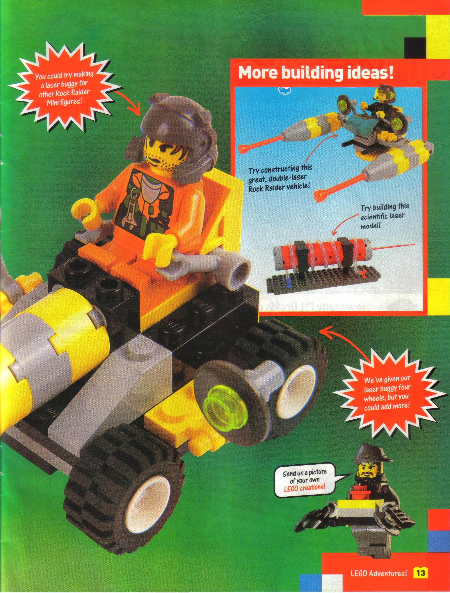

Double-Laser Vehicle
==============

Notes
-----
* Captioned as "great, double-laser Rock Raider vehicle" but does not have an official name.
* The only uncertainty about this build comes from the 1x2 plate space under the back of the yellow seat.

Buildability
------------

Fully buildable.

References Images
-----

<small>[LEGO Adventures! Issue 18 - September 2000, page 13](https://archive.org/details/LEGOAdventures-No18Sep2000-Brickshelf/page/12/mode/2up)</small>