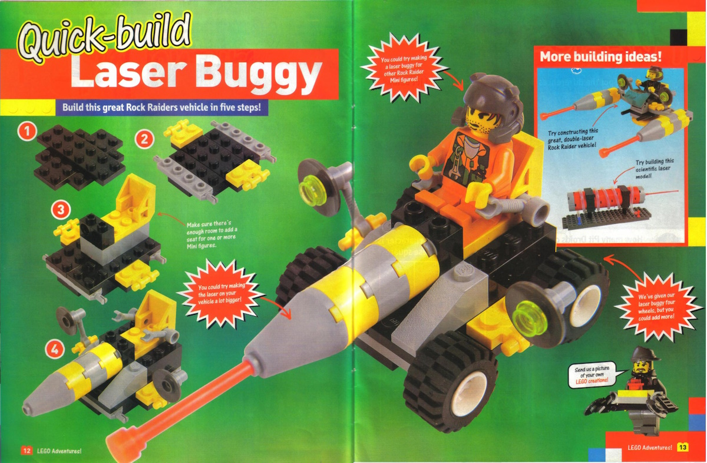

Laser Buggy
==============

Notes
-----

* Instructions for this build were included in [LEGO Adventures! Issue 18 - September 2000](https://archive.org/details/LEGOAdventures-No18Sep2000-Brickshelf/page/12/mode/2up) on pages 12-13.

Buildability
------------

Fully buildable.

References Images
-----

<small>[LEGO Adventures! Issue 18 - September 2000, pages 12-13](https://archive.org/details/LEGOAdventures-No18Sep2000-Brickshelf/page/12/mode/2up)</small>